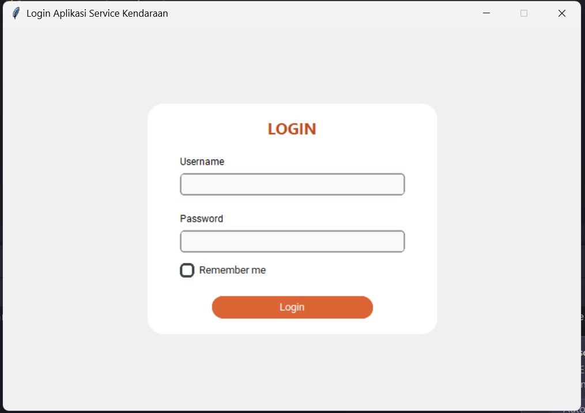
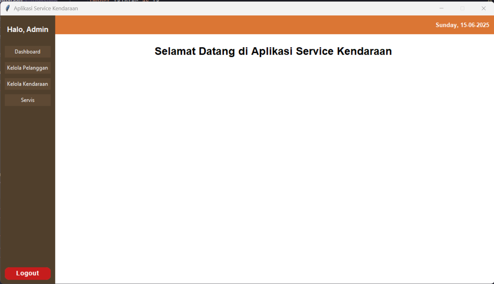
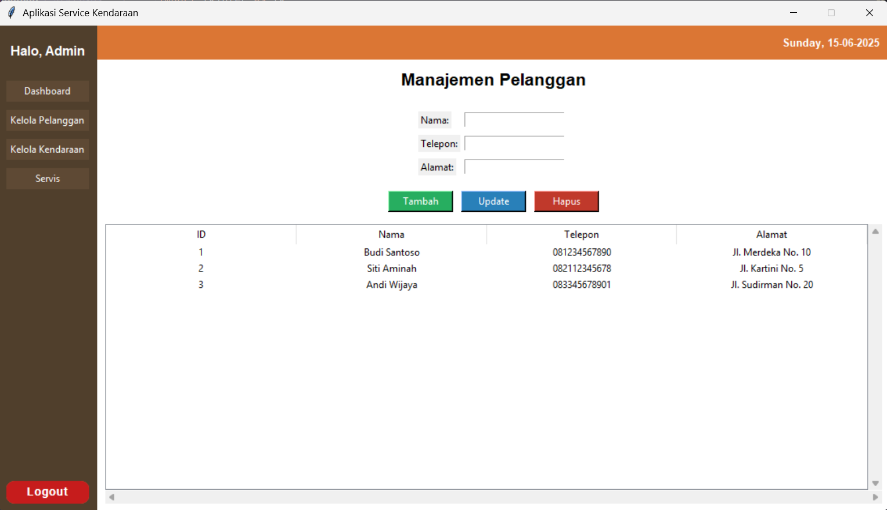
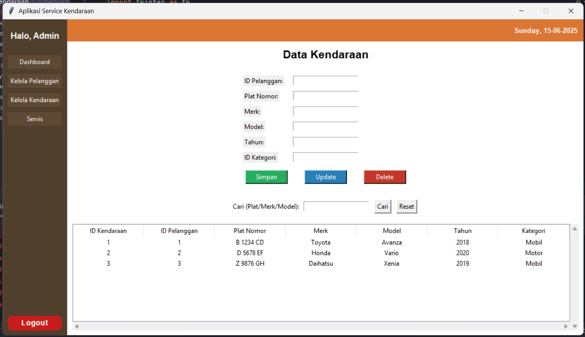
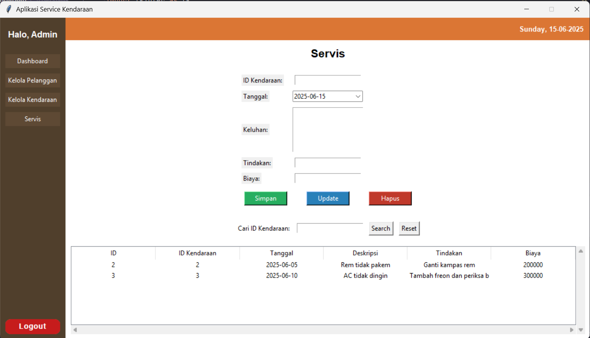

# Sistem Manajemen Servis Kendaraan
Aplikasi desktop untuk mengelola data pelanggan, kendaraan, dan riwayat servis kendaraan. Dibangun menggunakan Tkinter untuk antarmuka pengguna grafis (GUI) dan MySQL Connector untuk interaksi basis data.

# Fitur Utama
### Aplikasi ini menyediakan fungsionalitas komprehensif untuk berbagai peran pengguna:

Autentikasi Pengguna: Sistem login dengan peran berbeda (Admin dan Teknisi).

Manajemen Pelanggan (Admin):
- Menambah, mengubah, dan menghapus data pelanggan.
- Melihat daftar pelanggan dalam tabel yang interaktif.
    
Manajemen Kendaraan (Admin & Teknisi):
- Menambah, mengubah, dan menghapus data kendaraan.
- Melihat detail kendaraan, termasuk informasi kategori kendaraan.
- Fungsi pencarian untuk memfilter data kendaraan berdasarkan plat nomor, merk, atau model.
    
Riwayat Servis:
- Mencatat detail servis kendaraan, termasuk tanggal, keluhan, tindakan yang dilakukan, dan biaya.
- Mengupdate dan menghapus catatan servis yang ada.
- Pencarian riwayat servis berdasarkan ID Kendaraan.
    
Antarmuka Responsif: Desain UI yang menyesuaikan dengan ukuran layar dan memberikan pengalaman pengguna yang intuitif.

# Peran Pengguna
### Aplikasi ini mendukung dua peran pengguna utama:

- Admin: Memiliki akses penuh ke manajemen pelanggan, kendaraan, dan riwayat servis.
- Teknisi: Hanya dapat melihat data kendaraan dan mengelola riwayat servis.

# Teknologi yang Digunakan
- Python: Bahasa pemrograman utama.
- Tkinter: Library standar Python untuk GUI.
- CustomTkinter: Ekstensi untuk Tkinter yang menyediakan widget modern.
- tkCalendar: Widget kalender untuk pemilihan tanggal yang mudah.
- MySQL Connector: Driver Python untuk berinteraksi dengan database MySQL.
- MySQL: Sistem manajemen database relasional untuk menyimpan data aplikasi.

# Persyaratan Sistem
### Untuk menjalankan aplikasi ini, Anda memerlukan:

- Python 3.x
- Server MySQL yang sedang berjalan

# Tampilan Antarmuka

